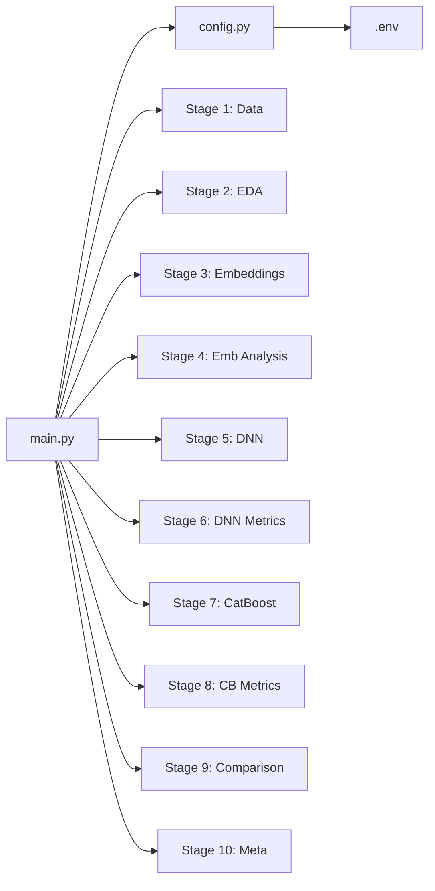

# Double Descent Research Pipeline

## Architecture




## Project Structure

```
double-descent-gbdt/
  .env                        # All configuration
  main.py                     # Entry point (minimal logic, calls modules)
  pyproject.toml              # uv dependencies
  src/
    __init__.py
    config.py                 # Settings from .env via pydantic-settings
    cache.py                  # Hash-based caching (check inputs hash, skip if match)
    plotting.py               # Plotly helpers: save .html (offline) + .png
    logging_setup.py          # Structured logging setup
    stages/
      __init__.py
      s01_data.py             # Kaggle download / CSV load, preprocessing, train/val/test split
      s02_eda.py              # EDA: class balance, text length, word count, plotly charts
      s03_embeddings.py       # Embedding extraction (Ollama + vLLM backends, async parallel)
      s04_embedding_analysis.py  # UMAP 2D scatter (by y_true), PCA 256, explained variance, dim reduction
      s05_dnn_train.py        # DNN (PyTorch MLP): model-wise + epoch-wise double descent
      s06_dnn_metrics.py      # Threshold analysis, calibration, probability distributions, UMAP by proba/pred
      s07_catboost_train.py   # CatBoost: DD log-loss params + ablation sweeps
      s08_catboost_metrics.py # Same metrics as s06
      s09_comparison.py       # CatBoost vs DNN: distributions, metrics, scatter, complexity
      s10_meta.py             # Hardware info, SEED, timing, versions -> JSON
  data/
    AI_Human.csv
  result/                     # All outputs (per-stage subdirectories)
```

## Configuration (.env)

Key parameters (all overridable):

- `MODE=fast` / `full` -- fast uses first 100 rows
- `SEED=42`
- `EMBEDDING_BACKEND=ollama` / `vllm`
- `OLLAMA_URL=http://localhost:11434`
- `VLLM_URL=http://localhost:8000`
- `EMBEDDING_MODEL=embeddinggemma:latest`
- `EMBEDDING_BATCH_SIZE=64`
- `EMBEDDING_MAX_CONCURRENT=16`
- `DATA_PATH=data/AI_Human.csv`
- `RESULT_DIR=result`
- `TRAIN_RATIO=0.7`, `VAL_RATIO=0.15`, `TEST_RATIO=0.15`
- DNN hyperparams: `DNN_EPOCHS`, `DNN_WIDTHS`, `DNN_LR`, `DNN_LABEL_NOISE`
- CatBoost hyperparams: `CB_ITERATIONS`, `CB_LR`, `CB_DEPTH`, `CB_L2_LEAF_REG`, `CB_RANDOM_STRENGTH`

`pydantic-settings` `BaseSettings` in `src/config.py` loads all from `.env` with typed defaults.

## Stage Details

### S01: Data Loading and Preprocessing (`[src/stages/s01_data.py](src/stages/s01_data.py)`)

- Download from Kaggle via `kagglehub` if CSV absent, else read existing
- Basic text preprocessing (strip whitespace, drop empty/duplicates)
- Stratified train/val/test split (70/15/15)
- In `fast` mode: take first 100 rows before split
- Cache: save split DataFrames to parquet in `result/01_data/`

### S02: EDA (`[src/stages/s02_eda.py](src/stages/s02_eda.py)`)

- Class balance bar chart
- Text length / word count distributions (by class)
- Top N-grams per class
- All charts: Plotly `.html` (include_plotlyjs="cdn" replaced with offline bundle) + `.png` via kaleido
- Save to `result/02_eda/`

### S03: Embeddings (`[src/stages/s03_embeddings.py](src/stages/s03_embeddings.py)`)

- Two backends:
  - **Ollama**: POST `{OLLAMA_URL}/api/embed` with `model` and `input` (batch)
  - **vLLM**: POST `{VLLM_URL}/v1/embeddings` (OpenAI-compatible)
- `asyncio` + `aiohttp` for parallel requests (`EMBEDDING_MAX_CONCURRENT` semaphore)
- Progress bar via `tqdm`
- Cache: save embeddings as `.npy` in `result/03_embeddings/`, with hash of texts + model name

### S04: Embedding Analysis (`[src/stages/s04_embedding_analysis.py](src/stages/s04_embedding_analysis.py)`)

- UMAP 2D projection + Plotly scatter colored by `y_true`
- PCA to 256 dims; explained variance ratio plot
- If cumulative explained variance at 256 >= 95%, reduce to 128 dims; else keep original
- Save reduced embeddings + all plots to `result/04_embedding_analysis/`

### S05: DNN Training (`[src/stages/s05_dnn_train.py](src/stages/s05_dnn_train.py)`)

**Model-wise double descent:**

- Train MLPs of increasing width: e.g. `[8, 16, 32, 64, 128, 256, 512, 1024, 2048, 4096]`
- Architecture: `Input -> Linear(width) -> ReLU -> Linear(width) -> ReLU -> Linear(1) -> Sigmoid`
- Fixed epoch count sufficient to converge (or near-interpolation)
- Plot test/train logloss, accuracy vs number of parameters
- Optional label noise (flip fraction of labels) to amplify the interpolation peak (per Nakkiran et al.)

**Epoch-wise double descent:**

- Pick a width near/above interpolation threshold
- Train for many epochs (e.g. 4000)
- Log train/val logloss, accuracy every N epochs
- Plot curves showing plateau then second descent

All training with `torch`, `Adam`, `BCEWithLogitsLoss`. Save per-epoch metrics as JSON + Plotly charts to `result/05_dnn/`.

### S06: DNN Metrics (`[src/stages/s06_dnn_metrics.py](src/stages/s06_dnn_metrics.py)`)

- Best model from S05 evaluated on test set
- Threshold analysis: F1-optimal, ROC-optimal, prevalence-based
- Metrics at each threshold: precision, recall, F1, accuracy
- Probability distribution histograms (train/val/test) by true class
- Calibration curve (reliability diagram)
- UMAP 2D scatter colored by predicted probability + by predicted class + by y_true
- Save all to `result/06_dnn_metrics/`

### S07: CatBoost Training (`[src/stages/s07_catboost_train.py](src/stages/s07_catboost_train.py)`)

**Main experiment (second descent log-loss):**

- Parameters designed to produce the two-phase behavior from the articles:
  - `iterations=20000`, `learning_rate=0.01`, `depth=8`, `l2_leaf_reg=50`, `random_strength=20`, `use_best_model=False`
- Log per-iteration: train/val logloss, AUC, accuracy
- Track **margin dynamics**: `RawFormulaVal` statistics (mean, quantiles, fraction y*margin > 0/2) at checkpoints

**Ablation sweeps (to understand which parameter drives DD):**

- Sweep `random_strength`: {0, 1, 5, 10, 20}
- Sweep `l2_leaf_reg`: {1, 3, 10, 30, 100}
- Sweep `learning_rate` at constant `lr * iterations`: e.g. (0.1, 2000), (0.01, 20000), (0.005, 40000)

Plots:

- Train/val logloss vs iteration (all sweeps overlaid)
- Margin distribution evolution
- Feature importance before/after "phase switch"
- Save to `result/07_catboost/`

### S08: CatBoost Metrics (`[src/stages/s08_catboost_metrics.py](src/stages/s08_catboost_metrics.py)`)

- Identical analysis to S06 but for best CatBoost model
- Save to `result/08_catboost_metrics/`

### S09: Comparison (`[src/stages/s09_comparison.py](src/stages/s09_comparison.py)`)

- Side-by-side metrics table (JSON + Plotly table)
- Scatter plot: CatBoost probabilities vs DNN probabilities (colored by y_true)
- Probability distribution overlay
- Model complexity comparison (params count, training time)
- Disagreement analysis (where models differ)
- Save to `result/09_comparison/`

### S10: Metadata (`[src/stages/s10_meta.py](src/stages/s10_meta.py)`)

- Hardware: CPU, RAM, GPU (if any)
- Python, torch, catboost versions
- SEED, mode, timing per stage
- Save as `result/meta.json`

## Caching Strategy

`src/cache.py`: each stage computes a deterministic hash of its inputs (data hash, config params). Before running, check if `result/<stage>/cache_hash.json` matches. If yes, skip and load cached artifacts. If no, run and save new hash + artifacts.

## Dependencies (`[pyproject.toml](pyproject.toml)`)

Managed via `uv`:

- pandas, numpy, scikit-learn
- catboost
- torch (CPU or CUDA)
- plotly, kaleido
- umap-learn
- aiohttp
- tqdm
- pydantic-settings, python-dotenv
- kagglehub

